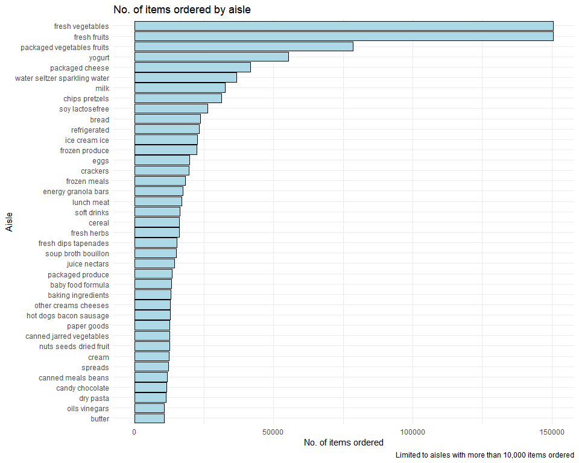

P8105 HOMEWORK 3
================
Anu Singh
2025-10-13

Before beginning, loading core libraries (tidyverse).

``` r
library(tidyverse)
```

## PROBLEM 1

### General dataset description

``` r
# Loading instacart
library(p8105.datasets)
data("instacart")

# Quick overview of structure
rows = nrow(instacart)
columns = ncol(instacart)

# Checking variable names
column_names = colnames(instacart)

# First rows of dataset to show data structure
t(head(instacart, 1)) # transposed in order to show all variable names
```

    ##                        [,1]              
    ## order_id               "1"               
    ## product_id             "49302"           
    ## add_to_cart_order      "1"               
    ## reordered              "1"               
    ## user_id                "112108"          
    ## eval_set               "train"           
    ## order_number           "4"               
    ## order_dow              "4"               
    ## order_hour_of_day      "10"              
    ## days_since_prior_order "9"               
    ## product_name           "Bulgarian Yogurt"
    ## aisle_id               "120"             
    ## department_id          "16"              
    ## aisle                  "yogurt"          
    ## department             "dairy eggs"

The Instacart dataset contains 1384617 observations (where each row
represents an order of a single product from an Instacart order) and 15
variables. Key variables in this dataset include:

- order_id: order identifier
- product_name: name of product
- aisle: name of aisle/product location
- department: department
- order_dow: day of the week on which the order was placed
- order_hour_of_day: hour of the day on which the order was placed

### 1. Total no. of aisles, most ordered from aisles

``` r
# Counting unique aisles
no_of_aisles = instacart %>% 
  distinct(aisle_id) %>% 
  nrow()

# Most ordered from aisles
aisle_counts = instacart %>% 
  group_by(aisle) %>% 
  summarize(no_of_items = n()) %>% 
  arrange(desc(no_of_items))

head(aisle_counts, 5)
```

    ## # A tibble: 5 × 2
    ##   aisle                      no_of_items
    ##   <chr>                            <int>
    ## 1 fresh vegetables                150609
    ## 2 fresh fruits                    150473
    ## 3 packaged vegetables fruits       78493
    ## 4 yogurt                           55240
    ## 5 packaged cheese                  41699

There are 134 in total. The top five most ordered from aisles include:
fresh vegetables, fresh fruits, packaged vegetables fruit, yogurt, and
packaged cheese.

### 2. Plot of no. of items ordered in each aisle (for aisles with more than 10000 items ordered)

``` r
aisle_counts %>%
  filter(no_of_items > 10000) %>%
  mutate(aisle = fct_reorder(aisle, no_of_items)) %>%
  ggplot(aes(x = no_of_items, y = aisle)) +
  geom_col(fill = "steelblue") +
  labs(
    title = "No. of items ordered by aisle",
    caption = "Limited to aisles with more than 10,000 items ordered",
    x = "No. of items ordered",
    y = "Aisle"
  )
```

<!-- -->

### 3. Three most popular items in specific aisles

``` r
popular_items = instacart %>%
  filter(aisle %in% c("baking ingredients", "dog food care", "packaged vegetables fruits")) %>% # keeping rows with only specified aisle
  group_by(aisle, product_name) %>%
  summarize(no_of_orders = n(), .groups = "drop") %>% # removing grouping from the result
  group_by(aisle) %>%
  top_n(3, no_of_orders) %>% # keeping the top 3 rows with the highest no_of_order values
  arrange(aisle, desc(no_of_orders))

popular_items
```

    ## # A tibble: 9 × 3
    ## # Groups:   aisle [3]
    ##   aisle                      product_name                           no_of_orders
    ##   <chr>                      <chr>                                         <int>
    ## 1 baking ingredients         Light Brown Sugar                               499
    ## 2 baking ingredients         Pure Baking Soda                                387
    ## 3 baking ingredients         Cane Sugar                                      336
    ## 4 dog food care              Snack Sticks Chicken & Rice Recipe Do…           30
    ## 5 dog food care              Organix Chicken & Brown Rice Recipe              28
    ## 6 dog food care              Small Dog Biscuits                               26
    ## 7 packaged vegetables fruits Organic Baby Spinach                           9784
    ## 8 packaged vegetables fruits Organic Raspberries                            5546
    ## 9 packaged vegetables fruits Organic Blueberries                            4966

### 4. Pink Lady Apples and Coffee Ice Cream orders

``` r
mean_hour_table <- instacart %>%
  filter(product_name %in% c("Pink Lady Apples", "Coffee Ice Cream")) %>%
  group_by(product_name, order_dow) %>%
  summarize(mean_hour = mean(order_hour_of_day), .groups = "drop") %>% #removing grouping from the result
  mutate(
    day_of_week = case_when(
      order_dow == 0 ~ "Sunday",
      order_dow == 1 ~ "Monday",
      order_dow == 2 ~ "Tuesday",
      order_dow == 3 ~ "Wednesday",
      order_dow == 4 ~ "Thursday",
      order_dow == 5 ~ "Friday",
      order_dow == 6 ~ "Saturday"
    ),
    day_of_week = factor(day_of_week, levels = c("Sunday", "Monday", "Tuesday", 
                                                   "Wednesday", "Thursday", "Friday", "Saturday"))
  ) %>%
  select(product_name, day_of_week, mean_hour) %>%
  pivot_wider(
    names_from = day_of_week,
    values_from = mean_hour
  )

mean_hour_table
```

    ## # A tibble: 2 × 8
    ##   product_name     Sunday Monday Tuesday Wednesday Thursday Friday Saturday
    ##   <chr>             <dbl>  <dbl>   <dbl>     <dbl>    <dbl>  <dbl>    <dbl>
    ## 1 Coffee Ice Cream   13.8   14.3    15.4      15.3     15.2   12.3     13.8
    ## 2 Pink Lady Apples   13.4   11.4    11.7      14.2     11.6   12.8     11.9

## PROBLEM 2

## PROBLEM 3
