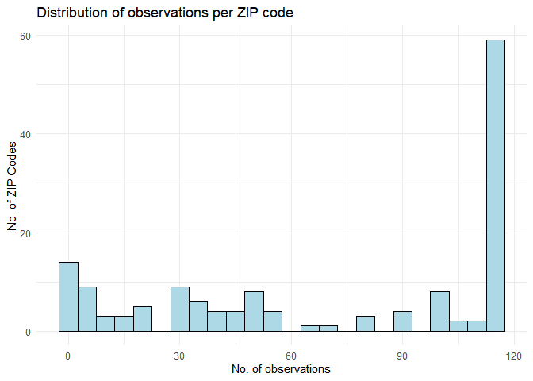
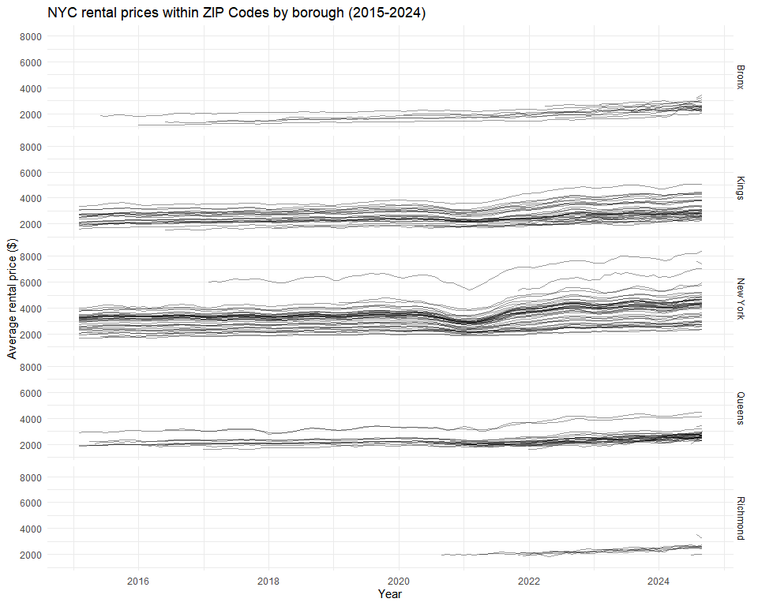
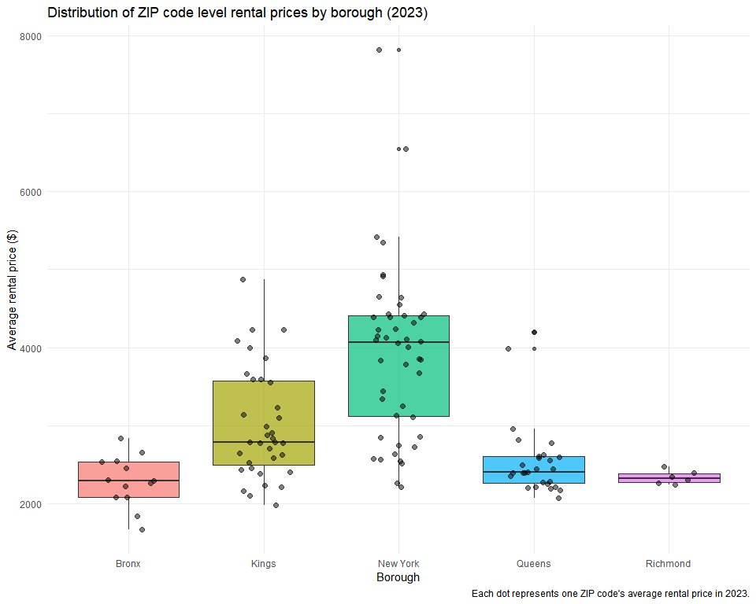
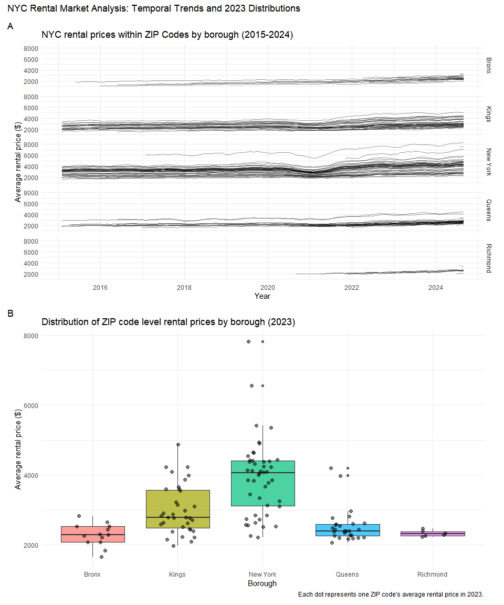
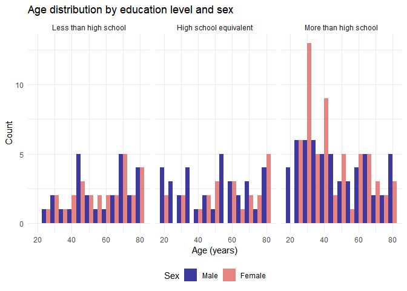
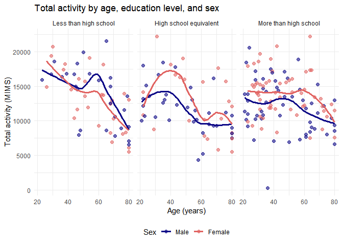
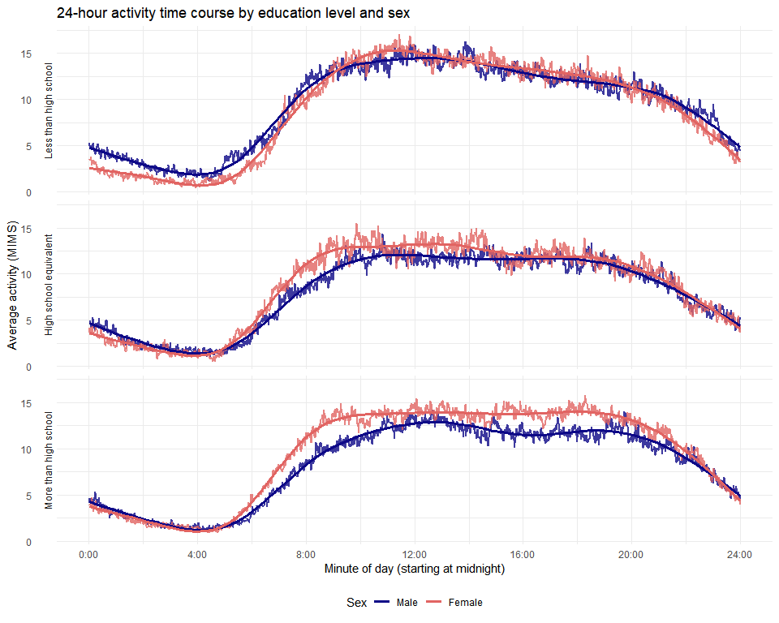

P8105 HOMEWORK 3
================
Anu Singh
2025-10-13

Before beginning, loading core libraries (tidyverse).

``` r
library(tidyverse)
library(patchwork)

theme_set(theme_minimal() + theme(legend.position = "bottom"))
```

## PROBLEM 1

### General dataset description

``` r
# Loading instacart
library(p8105.datasets)
data("instacart")

# Quick overview of structure
rows = nrow(instacart)
columns = ncol(instacart)

# Checking variable names
column_names = colnames(instacart)

# First rows of dataset to show data structure
t(head(instacart, 1)) # transposed in order to show all variable names
```

    ##                        [,1]              
    ## order_id               "1"               
    ## product_id             "49302"           
    ## add_to_cart_order      "1"               
    ## reordered              "1"               
    ## user_id                "112108"          
    ## eval_set               "train"           
    ## order_number           "4"               
    ## order_dow              "4"               
    ## order_hour_of_day      "10"              
    ## days_since_prior_order "9"               
    ## product_name           "Bulgarian Yogurt"
    ## aisle_id               "120"             
    ## department_id          "16"              
    ## aisle                  "yogurt"          
    ## department             "dairy eggs"

The Instacart dataset contains 1384617 observations (where each row
represents an order of a single product from an Instacart order) and 15
variables. Key variables in this dataset include:

- order_id: order identifier
- product_name: name of product
- aisle: name of aisle/product location
- department: department
- order_dow: day of the week on which the order was placed
- order_hour_of_day: hour of the day on which the order was placed

### 1. Total no. of aisles, most ordered from aisles

``` r
# Counting unique aisles
no_of_aisles = instacart %>% 
  distinct(aisle_id) %>% 
  nrow()

# Most ordered from aisles
aisle_counts = instacart %>% 
  group_by(aisle) %>% 
  summarize(no_of_items = n()) %>% 
  arrange(desc(no_of_items))

head(aisle_counts, 5)
```

    ## # A tibble: 5 × 2
    ##   aisle                      no_of_items
    ##   <chr>                            <int>
    ## 1 fresh vegetables                150609
    ## 2 fresh fruits                    150473
    ## 3 packaged vegetables fruits       78493
    ## 4 yogurt                           55240
    ## 5 packaged cheese                  41699

There are 134 in total. The top five most ordered from aisles include:
fresh vegetables, fresh fruits, packaged vegetables fruit, yogurt, and
packaged cheese.

### 2. Plot of no. of items ordered in each aisle (for aisles with more than 10000 items ordered)

``` r
aisle_counts %>%
  filter(no_of_items > 10000) %>%
  mutate(aisle = fct_reorder(aisle, no_of_items)) %>%
  ggplot(aes(x = no_of_items, y = aisle)) +
  geom_col(fill = "lightblue", color = "black") +
  labs(
    title = "No. of items ordered by aisle",
    caption = "Limited to aisles with more than 10,000 items ordered",
    x = "No. of items ordered",
    y = "Aisle"
  )
```

<!-- -->

### 3. Three most popular items in specific aisles

``` r
popular_items = instacart %>%
  filter(aisle %in% c("baking ingredients", "dog food care", "packaged vegetables fruits")) %>% # keeping rows with only specified aisle
  group_by(aisle, product_name) %>%
  summarize(no_of_orders = n(), .groups = "drop") %>% # removing grouping from the result
  group_by(aisle) %>%
  top_n(3, no_of_orders) %>% # keeping the top 3 rows with the highest no_of_order values
  arrange(aisle, desc(no_of_orders))

popular_items
```

    ## # A tibble: 9 × 3
    ## # Groups:   aisle [3]
    ##   aisle                      product_name                           no_of_orders
    ##   <chr>                      <chr>                                         <int>
    ## 1 baking ingredients         Light Brown Sugar                               499
    ## 2 baking ingredients         Pure Baking Soda                                387
    ## 3 baking ingredients         Cane Sugar                                      336
    ## 4 dog food care              Snack Sticks Chicken & Rice Recipe Do…           30
    ## 5 dog food care              Organix Chicken & Brown Rice Recipe              28
    ## 6 dog food care              Small Dog Biscuits                               26
    ## 7 packaged vegetables fruits Organic Baby Spinach                           9784
    ## 8 packaged vegetables fruits Organic Raspberries                            5546
    ## 9 packaged vegetables fruits Organic Blueberries                            4966

### 4. Pink Lady Apples and Coffee Ice Cream orders

``` r
mean_hour_table = instacart %>%
  filter(product_name %in% c("Pink Lady Apples", "Coffee Ice Cream")) %>%
  group_by(product_name, order_dow) %>%
  summarize(mean_hour = mean(order_hour_of_day), .groups = "drop") %>% #removing grouping from the result
  mutate(
    day_of_week = case_when(
      order_dow == 0 ~ "Sunday",
      order_dow == 1 ~ "Monday",
      order_dow == 2 ~ "Tuesday",
      order_dow == 3 ~ "Wednesday",
      order_dow == 4 ~ "Thursday",
      order_dow == 5 ~ "Friday",
      order_dow == 6 ~ "Saturday"
    ),
    day_of_week = factor(day_of_week, levels = c("Sunday", "Monday", "Tuesday", 
                                                   "Wednesday", "Thursday", "Friday", "Saturday"))
  ) %>%
  select(product_name, day_of_week, mean_hour) %>%
  pivot_wider(
    names_from = day_of_week,
    values_from = mean_hour
  )

mean_hour_table
```

    ## # A tibble: 2 × 8
    ##   product_name     Sunday Monday Tuesday Wednesday Thursday Friday Saturday
    ##   <chr>             <dbl>  <dbl>   <dbl>     <dbl>    <dbl>  <dbl>    <dbl>
    ## 1 Coffee Ice Cream   13.8   14.3    15.4      15.3     15.2   12.3     13.8
    ## 2 Pink Lady Apples   13.4   11.4    11.7      14.2     11.6   12.8     11.9

## PROBLEM 2

### 1. Data import and cleaning

``` r
# Importing ZIP codes data
zip_codes = read_csv("./data/Zip Codes.csv") %>%
  janitor::clean_names() %>%
  select(zip_code, county, neighborhood) # selecting only necessary columns

# Importing rental price data
rental_data = read_csv("./data/Zip_zori_uc_sfrcondomfr_sm_month_NYC.csv") %>%
  janitor::clean_names()
```

The above CSV files have been cleaned for analysis below.

### 2. ZIP codes frequency

``` r
# Reshaping data to long format to count observations per ZIP code
rental_long = rental_data %>%
  pivot_longer(
    cols = starts_with("x20"),
    names_to = "date",
    values_to = "rental_price"
  ) %>%
  filter(!is.na(rental_price)) # removing any observation without values

# Counting observations per ZIP code
zip_observations = rental_long %>%
  group_by(region_name) %>%
  summarise(no_of_observations = n()) %>%
  arrange(desc(no_of_observations))

# Answer to the questions
no_full_observation = sum(zip_observations$no_of_observations == 116)
no_fewer_than_10 = sum(zip_observations$no_of_observations < 10)

# Distribution of the observations
ggplot(zip_observations, aes(x = no_of_observations)) +
  geom_histogram(binwidth = 5, fill = "lightblue", color = "black") +
  labs(
    title = "Distribution of observations per ZIP Code",
    x = "No. of observations",
    y = "No. of ZIP Codes"
  ) 
```

<!-- -->
There are 48 ZIP codes observed 116 times (all available months from
January 2015 to August 2024), and 26 ZIP codes observed fewer than 10
times. Some zip codes are observed rarely, which may be for several
reasons:

- New developments: some ZIP codes may have been added to the dataset
  later, so they do not have data going back to 2015
- Insufficient rental inventory: ZIP codes with very few rental
  properties may not meet Zillow’s threshold for reporting rental prices
- Data quality issues: some areas may have inconsistent or insufficient
  data for Zillow to calculate reliable rental price estimates

### 3. Average rental price by borough and year

``` r
# Joining with ZIP code data to get borough information
rental_with_borough = rental_long %>%
  left_join(zip_codes, by = c("region_name" = "zip_code")) %>%
  mutate(
    date = str_remove(date, "^x"),
    date = as.Date(date, format = "%Y_%m_%d"),
    year = year(date) # extracting year from date
  )

# Calculating average rental price by borough and year
borough_year_avg = rental_with_borough %>%
  group_by(county, year) %>%
  summarise(
    avg_rental_price = mean(rental_price, na.rm = TRUE),
    .groups = "drop" 
  ) %>%
  pivot_wider(
    names_from = year,
    values_from = avg_rental_price,
    names_prefix = "Year_"
  )

# Displaying the table
knitr::kable(
  borough_year_avg,
  digits = 2, # rounding to 2 decimal places
  caption = "Average rental price ($) by borough and year",
  col.names = c("Borough", as.character(2015:2024)) # tidying column names
)
```

| Borough | 2015 | 2016 | 2017 | 2018 | 2019 | 2020 | 2021 | 2022 | 2023 | 2024 |
|:---|---:|---:|---:|---:|---:|---:|---:|---:|---:|---:|
| Bronx | 1759.60 | 1520.19 | 1543.60 | 1639.43 | 1705.59 | 1811.44 | 1857.78 | 2054.27 | 2285.46 | 2496.90 |
| Kings | 2492.93 | 2520.36 | 2545.83 | 2547.29 | 2630.50 | 2555.05 | 2549.89 | 2868.20 | 3015.18 | 3125.66 |
| New York | 3006.29 | 3014.57 | 3109.10 | 3159.67 | 3285.33 | 3091.33 | 3124.34 | 3753.08 | 3908.22 | 4052.81 |
| Queens | 2214.71 | 2271.96 | 2263.30 | 2291.92 | 2387.82 | 2315.63 | 2210.79 | 2406.04 | 2561.62 | 2693.58 |
| Richmond | NA | NA | NA | NA | NA | 1977.61 | 2045.43 | 2147.44 | 2332.93 | 2536.44 |

Average rental price (\$) by borough and year

All boroughs show upward trends in rental prices from 2015 to 2024. New
York consistently has the highest rental prices, starting around \$3,000
in 2015 and reaching over \$4,000 by 2024. Kings shows steady growth
with significant increases from 2020 onwards, moving from approximately
\$2,500 to over \$3,100. Queens shows moderate and consistent growth
throughout the period, staying in the \$2,200-\$2,700 range. The Bronx
maintains the most affordable prices but still shows upward trends,
starting around \$1,760 and reaching nearly \$2,500 by 2024. Richmond
has missing data (NA) for 2015-2019 but shows relatively stable prices
from 2020-2024, ranging from about \$1,980 to \$2,540.

### 4. Plot of NYC rental prices within ZIP codes, for all boroughs

``` r
# Creating plot showing rental prices over time within ZIP codes, using facet_grid by borough
price_plots = rental_with_borough %>%
  filter(!is.na(county)) %>%
  ggplot(aes(x = date, y = rental_price, group = region_name)) +
  geom_line(alpha = 0.4, linewidth = 0.5) +
  facet_grid(county ~ .) +
  labs(
    title = "NYC rental prices within ZIP Codes by borough (2015-2024)",
    x = "Year",
    y = "Average rental price ($)"
  ) 
print(price_plots)
```

<!-- --> The
plot shows significant variation in rental price trajectories within
each borough. New York shows the widest range of ZIP code prices, with
some areas exceeding \$6,000/month while others remain around \$2,500.
Kings displays a similar pattern with significant variation. The Bronx
shows the most consistency, with ZIP codes clustering together and
moving in parallel, suggesting more uniform housing costs. Queens shows
moderate variation with most ZIP codes following similar upward trends.
Richmond has limited data but shows tight clustering among its ZIP
codes.

### 5. 2023 rental prices by borough

``` r
# Calculating average rental price per ZIP code in 2023
zip_2023_avg = rental_with_borough %>%
  filter(year == 2023) %>%
  group_by(region_name, county) %>%
  summarise(avg_rental_price = mean(rental_price, na.rm = TRUE), .groups = "drop") %>%
  filter(!is.na(county))

# Creating boxplot (to show distribution)
box_plots = ggplot(zip_2023_avg, aes(x = county, y = avg_rental_price, fill = county)) +
  geom_boxplot(alpha = 0.7) +
  geom_jitter(width = 0.2, alpha = 0.5, size = 2) + # adding individual average rental prices
  labs(
    title = "Distribution of ZIP code level rental prices by borough (2023)",
    x = "Borough",
    y = "Average Rental Price ($)",
    caption = "Each dot represents one ZIP code's average rental price in 2023."
  ) + 
  theme(legend.position = "none")

print(box_plots)
```

<!-- -->
The distribution plot illustrates substantial variation in rental prices
both between and within boroughs. New York shows the highest median
rental price and the widest range, with some ZIP codes exceeding \$6,000
per month. Kings displays significant variation with several high-priced
outlier ZIP codes comparable to New York prices. Queens shows a more
compressed distribution with moderate prices and fewer extreme outliers.
The Bronx has a more concentrated distribution, with most ZIP codes
clustering around \$2,000-\$2,500. Richmond shows the tightest
distribution with the least variation between ZIP codes.

### 6. Combining plots into a single graphic

``` r
# Combining the two plots
combined_plot = price_plots / box_plots +
  plot_annotation(
    title = "NYC Rental Market Analysis: Temporal Trends and 2023 Distributions",
    tag_levels = "A"
  )

print(combined_plot)
```

<!-- -->

``` r
# Exporting to results folder
ggsave("./results/nyc_rental_analysis.jpg",
       plot = combined_plot,
       width = 14,
       height = 14
)
```

The combined graphic has been exported to the `results/` folder as
`nyc_rental_analysis.jpg`.

## PROBLEM 3

### 1. Data loading and cleaning

``` r
# Loading demographic data (skipping first 4 rows which contain variable descriptions)
nhanes_covar = read_csv("./data/nhanes_covar.csv", skip = 4) %>%
  janitor::clean_names() %>%
  mutate(
    sex = factor(sex, levels = c(1, 2), labels = c("Male", "Female")), # adding appropriate labels
    education = factor(education, 
                      levels = c(1, 2, 3), 
                      labels = c("Less than high school", 
                                "High school equivalent", 
                                "More than high school")) # adding appropriate labels
  ) %>%
  filter(age >= 21) %>% # excluding participants less than 21 years of age
  drop_na() # dropping rows with missing demographic data

# Loading accelerometer data
nhanes_accel = read_csv("./data/nhanes_accel.csv") %>%
  janitor::clean_names()

# Merging datasets
nhanes_data = inner_join(nhanes_covar, nhanes_accel, by = "seqn")
```

The final dataset includes 228 participants after excluding those under
21 years of age and those with missing demographic data.

### 2. Demographics table

``` r
# Creating summary table
demo_table = nhanes_data %>%
  group_by(education, sex) %>%
  summarise(count = n(), .groups = "drop") %>%
  pivot_wider(names_from = sex, values_from = count, values_fill = 0)

knitr::kable(demo_table, 
      caption = "No. of men and women in each education category")
```

| education              | Male | Female |
|:-----------------------|-----:|-------:|
| Less than high school  |   27 |     28 |
| High school equivalent |   35 |     23 |
| More than high school  |   56 |     59 |

No. of men and women in each education category

``` r
# Visualizing age distributions by education and sex
nhanes_data %>%
  ggplot(aes(x = age, fill = sex)) +
  geom_histogram(position = "dodge", binwidth = 5, alpha = 0.8) +
  facet_wrap(~education) +
  labs(
    title = "Age Distribution by Education Level and Sex",
    x = "Age (years)",
    y = "Count",
    fill = "Sex"
  )
```

<!-- -->
The table shows the distribution of participants by sex and education
level. There are 118 male and 110 female participants. The “More than
high school” education category has the most participants overall. The
plots show that participants are spread across various age groups in all
education categories. The “More than high school” category appears to
have more younger participants, while “Less than high school” has more
older participants. Age distributions between males and females appear
relatively similar within each education level (with exception of “More
than high school” category, where younger females are disproportionately
higher than in value than males).

### 3. Total activity analysis

``` r
# Calculating total activity for each participant
nhanes_total = nhanes_data %>%
  mutate(total_activity = rowSums(select(., starts_with("min"))))

# Plotting total activity vs age by education and sex
nhanes_total %>%
  ggplot(aes(x = age, y = total_activity, color = sex)) +
  geom_point(alpha = 0.6, size = 2) +
  geom_smooth(method = "loess", se = FALSE, linewidth = 1.2) +
  facet_wrap(~education) +
  labs(
    title = "Total activity by age, education level, and sex",
    x = "Age (years)",
    y = "Total activity (MIMS)",
    color = "Sex"
  ) 
```

<!-- -->
Total activity generally declines with age across all education levels.
Women tend to have slightly higher activity levels than men in the “Less
than high school” and “High school equivalent” categories, particularly
among younger participants. After age 40, activity levels in women
decline below men in the “Less than high school” category. In the “More
than high school” category, activity patterns are more similar between
sexes. The decline in activity with age is most pronounced in
participants with less education.

### 4. 24-hour activity time course

``` r
# Reshaping data for time course analysis
nhanes_time = nhanes_data %>%
  pivot_longer(
    cols = starts_with("min"),
    names_to = "minute",
    values_to = "activity",
    names_prefix = "min"
  ) %>%
  mutate(minute = as.numeric(minute))

# Calculating mean activity by minute for each education and sex group
activity_time_course = nhanes_time %>%
  group_by(education, sex, minute) %>%
  summarise(mean_activity = mean(activity, na.rm = TRUE), .groups = "drop")

# Creating 3-panel plot
activity_time_course %>%
  ggplot(aes(x = minute, y = mean_activity, color = sex)) +
  geom_line(linewidth = 0.8, alpha = 0.8) +
  geom_smooth(se = FALSE, linewidth = 1.2) +
  facet_wrap(~education, ncol = 1) +
  labs(
    title = "24-hour activity time course by education level and sex",
    x = "Minute of day (starting at midnight)",
    y = "Average activity (MIMS)",
    color = "Sex"
  ) +
  scale_x_continuous(breaks = seq(0, 1440, 240),
                     labels = c("0:00", "4:00", "8:00", "12:00", 
                               "16:00", "20:00", "24:00"))
```

<!-- -->
The 24-hour activity patterns reveal clear diurnal rhythms across all
groups. Activity is minimal during nighttime hours (roughly midnight to
6am), increases during morning hours, peaks during midday and afternoon
(approximately 8am-4pm), and declines in the evening. Across all
education levels, women show slightly higher activity levels than men
during peak daytime hours, with slightly more pronounced difference in
the “More than high school” group.
